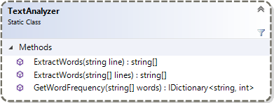

# <i class="fa fa-laptop"></i> Ordmekanikern

I denna uppgift ska du skapa en applikation vars uppgift är att analysera en godtycklig text som läses från en textfil och skriva till en annan textfil hur många gånger de olika orden i texten förekommer. Applikationen ska ta textfilernas namn som argument via parametern `args` i metoden `Main`. Applikationen får endast innehålla statiska klasser och medlemmar där klassen `Textanalyzer`måste implementeras minst enligt klassdiagrammet.

Textfilen, `Regeringsformen, 1 kap och 2 kap.txt` som finns i uppgiftens repo, ska ge en textfil med innehåll motsvarande `Frekvenstabell.txt` som du hittar i lösningen.

### Klassen `TextAnalyzer`

Applikationen ska innehålla den statiska klassen `TextAnalyzer` vars statiska metoder används för att dela upp en text i ord och bestämma ordens frekvens. Metoderna ska var _pure methods_ innebärande att de inte får av några sidoeffekter ledane till bestående förändringar.

<figure>

<figcaption>
Figur 1. Den statiska klassen <code>TextAnalyzer</code>.
</figcaption>
</figure>

Av klassdiagrammet kan du utläsa att parameterar och returtyper ofta är av interfacetyp, och inte någon konkret typ. Genom att låta metoder returnera en interfacetyp kan du välja vilken klass som helst som ska användas internt inne i metoden, så länge som klassen implementerar nämt interface.

Metoden `GetWordFrequncy` ska ha returtypen `IDictionary<string, int>`. Ett ”_dictionary_” består av två värden, en nyckel (_key_) och ett värde (_value_). Nyckeln kopplas till värdet, ungefär på samma sätt som ett index i en array kopplas till ett värde. Det finns en konkret klass som heter `Dictionary`, en samling som är osorterad, som implementerar interfacet `IDictionary`.

Ett `Dictionary`-objekt skapar du med `IDictionary<string, int> dic = new Dictionay<string, int>();` och redan här kan du använda en variabel av typen `IDictionary` för att referera till det skapade objektet. All funktionalitet som du behöver använda definieras av interfacet `IDictionary`, och implementeras av klassen `Dictionary`.
Interfacet `IDictionary` definierar bl.a. metoderna `ContainsKey()`, `Add()` och `TryGetValue`, som självklart klassen `Dictionary` implementerar. Dessa metoder använder du för att räkna hur många gånger ett ord förekommer och du får då en något låååångsam algoritm.

##### Något lååångsam algoritm

- För varje ord som hittas...
- Finns ordet redan i mappen? (`ContainsKey`)
- ...öka heltalet som är kopplat till ordet med 1. (använd operatorn [])
- ...annars...
- ...lägg till det nya ordet och initiera heltalet till 1. (`Add`, eller operatorn [])

##### Mindre långsam algoritm

Använd metoden `TryGetValue` och känn till att `out`-argumentets värde sätts till 0 om ordet inte hittas.

##### Snabbare algoritm(?)

Parallell bearbetning, `Parallel.ForEach`, av textrader vilket kräver användade av en trådsäker samling som t.ex. `ConcurrentDictionary`. (Overkill? Yep, but far more interesting!)

#### Mest intressant algoritm(?)

Inte mycket kod behöver skrivas om du använder LINQ med `GroupBy` och `ToDictionary`.

### Övriga klasser

Det står dig fritt att skapa egna statiska klasser för t.ex. applikation, hantering av persistent data, presentation av data, etc.

## <i class="fa fa-flag-checkered"></i> Mål

Efter att ha gjort uppgiften ska du:

- Kunna läsa från och skriva till filer.
- Kunna instansiera objekt av och hantera objekt instansierade klasser som implementerar interfacet `IDictionary`.
- Veta hur du använder gränssnittet (interfacet) `IDictionary`.

## <i class="fa fa-lightbulb-o"></i> Tips

Läs om:

- Arrayer
- Essential C# 6.0, 71-87. (inte flerdimensionella arrayer).
- http://msdn.microsoft.com/en-us/library/system.array.aspx
- http://msdn.microsoft.com/en-us/library/hh127989%28v=vs.88%29.aspx#Anchor_2 (under rubriken Arrays)
- "for each"-satsen
- Essential C# 6.0, 109, 140-142.
- https://msdn.microsoft.com/en-us/library/ttw7t8t6%28v=vs.110%29.aspx
- Samlingsklasser
- Essential C# 6.0, 646 ff.
- https://msdn.microsoft.com/en-us/library/7y3x785f%28v=vs.110%29.aspx
- https://msdn.microsoft.com/en-us/library/system.collections%28v=vs.110%29.aspx
- Interface
- Essential C# 6.0, 326-327.
- Artikeln [Vad är ett interface?](vad-ar-ett-interface.pdf "Interface")
- Interfacet `IDictionary`
- https://msdn.microsoft.com/en-us/library/system.collections.idictionary(v=vs.110).aspx
- Filhantering
- Essential C# 6.0, 232-235.
- ”Online”-dokumentationen om klasserna `StreamReader` och `StreamWriter` ger en hel del tips och mer exempel rörande filläsning:
- `StreamReader`, https://msdn.microsoft.com/en-us/library/system.io.streamreader%28v=vs.110%29.aspx#Anchor_7
- `StreamWriter`, https://msdn.microsoft.com/en-us/library/system.io.streamwriter%28v=vs.110%29.aspx#Anchor_7

## <i class="fa fa-flask"></i> Lösningsförslag
<ul class="fa-ul fa-border exercise-info">
<li><i class="fa-li fa fa-github"></i><a href="https://github.com/1dv024/exercise-solution-proposals/tree/master/exercise-word-mechanic">https://github.com/1dv024/exercise-solution-proposals/tree/master/exercise-word-mechanic</a></li>
</ul>